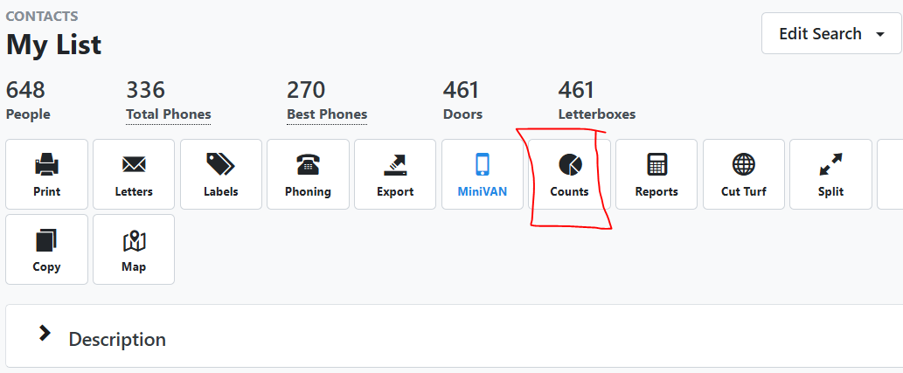
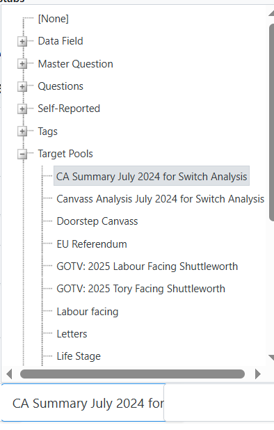
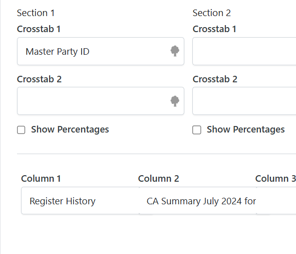
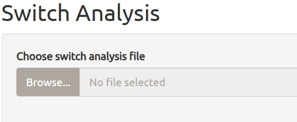
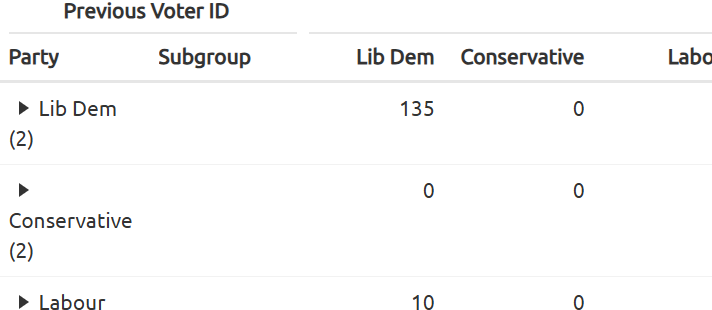
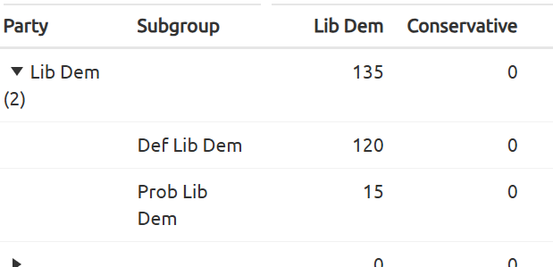
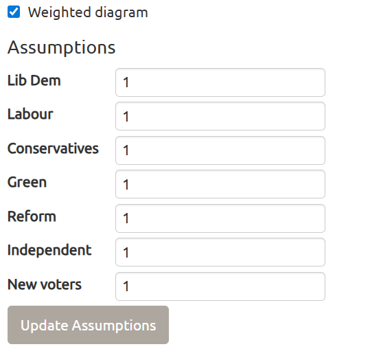
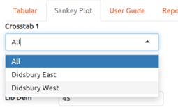
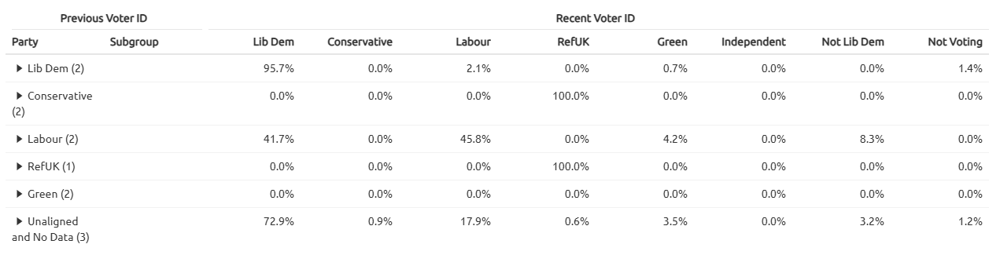

# Switch analysis

The app is available at
[aldc.shinyapps.io/switchanalysis](aldc.shinyapps.io/switchanalysis)

This tool was built to make interpreting switch analysis easier.

If you are a candidate, stop here and go and deliver some more leaflets
and knock on more doors. This is for campaign managers and backroom
staff. If you are unsure what switch analysis is, there is a guide on
the next tab.

As with all switch analyses, a large amount of data is needed. You get
the best results when you have several cycles of data but can still draw
inferences in a start up ward.

### Build your list

1.  Create a list on Connect

    - Select people who have responded to a vote intent question in a
      period
    - Make sure you have filtered by ward/constituency/etc
      - It can cope with multiple wards
    - You can pick a larger pool of people but you risk having a
      substantial number of people with no vote intent

2.  Run your list

3.  Click counts and then quick counts and cross tabs

    

### Build your Crosstabs

1.  In column 1, select your previous MPID by selecting the target pools
    option and picking the correct year

    - There are several options you can choose from. If you had locals
      in 2025 then pick MPID 2025, if you have locals in 2024 then 2024,
      etc etc.
      - These are in the target pools section

        
    - If you want to look at multiple wards, then choose ward in column
      1 and you previous MPID in column 2

2.  In crosstab 1, choose master questions, vote intent, recent MPID

    

3.  Refresh results, export to excel, ignore warnings and save

### Running the analysis

1.  Load the file. The file can be the raw ‘xls’ file from Connect (that
    is actually an HTML file!!) or xlsx file that you have otherwise
    saved.

2.  This will load a familiar looking table, on the left is previous
    voter ID and across is the recent voter ID

    

3.  You can expand each row to reveal any subgroups

    

4.  If there are multiple groups within your Recent MPID, then tick
    expand columns to show these (although it will collapse all rows
    that are already open).

5.  Tick the Show % box to express each row as a percentage.

    - Each row will be relative to its own number in the denominator and
      so will the aggregate rows
    - Be careful for small numbers in a row distorting percentages.

### Sankey Plot

#### The theory

A sankey plot will show the flow between two sets of states. The wider
the path the more people.

What we need to be careful of here is that there may be different
numbers of people in each group which could distort the size of the bar.

Without adding assumptions, you could be at risk making wrong
interpretation.

#### How to use

When you open the Sankey Plot tab, you will see the assumptions menu.

In here you can add weights to the bars so that the left side is
proportion to your own circumstances.

Currently, I would suggest using your previous election results and then
in new voters add the turnover in your ward.

This defaults to equal weights so you can see how each party is breaking
(but remember there may be distortions due to small numbers).

While no data includes, latent voters (those that have voted before but
don’t have any data) and new data. It is yet to be found whether these
different groups of breakdown differently.

Obviously, if you are starting from further back you are going to need
to switch more voters than if it is very close or you won previously.

The Sankey diagram can be slow to update.

This may be indicative of a prediction but currently is not valid as
one.

You can untick the weighted diagram box but this will distort the data.

#### Crosstabs

If you have an analysis that has extra crosstabs, it will give you the
option here to split by each the different options in the first cross
tab.

## Examples

There are examples of data available to [download from
github](https://github.com/sgbstats/switchanalysis)

### What is switch analysis?

Switch analysis is a toll that we can use to analyse our results from
canvassing. It gives us a detailed breakdown of how voter behave over
time.

#### Why can’t I just count how many definites (Ds) and probables (Ps) there are?

When you knock on doors, the people who answer the door aren’t random
and probably aren’t representative of your ward as a whole. You might go
knocking in your best polling district, get loads of Ds & Ps and then
think that you are going to win by a mile and then be sorely
disappointed come polling day. Conversely, certain types of voters are
more likely to answer the door (even if you did knock on every single
door in your ward) and this may skew the results of just taking the
percentages from the voter intent question.

#### What can switch analysis tell us?

If you have data from at least one, if not several cycles, you can see
how people who have answered a vote intent question multiple times move
between different parties.

#### Caveats

The analysis is only as good as the data that is put in. You need to
have good canvassers that can get a good vote intent out of voters.
Overly optimistic canvassing will only hurt you in the long run. Not
just giving you a more optimistic switch analysis but it will hurt your
polling day operation and then make the switch analysis worse in later
years when people are recanvassed.

### How to interpret switch analysis

In a switch analysis, the previous vote intent is always on the left and
the recent vote intent is always on the top.

What we can see is for each party where there voters are going (make
sure you have show % ticked). The percentage is always across a whole
row. In our example here, we can see that 95.7% of previously identified
LD voters are staying with us. However, we can see that only 46% of
Labour voters are sticking with them with 41%. This is seen as very good
for us.

Further down, you also want to be looking at your squeeze party. You
want to see lots of their voters coming towards us. As a general caveat,
if your squeeze voters are well heeled, they will start to show in the
Lib Dem pile and sticking with us.

Finally, what is often the largest group, No Data is important to look
at as that shows where the (mostly) uncavassed are saying they are going
to. We want to see a nice healthy chunk in our column and much larger
than our opponents. This line does often include previously not voting
and unaligned but they make up a very small number. This group will be a
mix of previously uncavassed people (who may or may not vote) and new to
register. The mix of these people will depend on your area, how much
work has been done in previous years, what the turnover in the ward is,
and whether people tend to answer their doors.

### A side note on questions

The way people end up in these groups is by answering questions which
have canvas points applied. These are questions include
`Vote Intent: Local Election`, Previous Vote, Usual Support, Party (1-5)
but only where they answer 4 or 5, and Consider Lib Dem. The canvas
points are not applied for Anti Party.

Be careful when using scripts that contain `Consider Lib Dem?`. If you
answer Yes without adding extra answers, you are likely to end up with
people in the wrong pool. This is specifically a squeeze question. If in
a Labour-facing area, a voter answers Conservetive, Consider: Yes they
become a very important voter because they can be Squeezed but one that
says Conservative, Consider No then you are unlikely to have them change
to vote for you. If you have (again in a Lab-facing area) a Labour voter
saying Cosider Yes then they should be put down as Soft Labour rather
than Consider Yes.

### Glossary

- Support pool: those likely to vote for us
- Switch pool: a group of voters that may switch from the main
  opposition to us
- Squeeze pool: voters who would normally vote for a 3rd, 4th, … party
  but would consider voting for us
- Suppress pool; Stay-at-Home pool: Voters who we would prefer didn’t
  vote at all because they will never vote at all.
- D; Def: Definite Lib Dem
- P; Prob: Probable Lib Dems
- SLab/SCon: Soft Labour/Conservative, those that wouldn’t rule us out
- *Colour* Lib Dem: A likely Lib Dem voter and the colour of their
  likely second choice. Strong Lib Dems can become Red/Blue/Green Lib
  Dems but never the other way round. This system also applies to other
  parties. Nat instead of a colour indicates Reform (and other
  nationalist parties).
